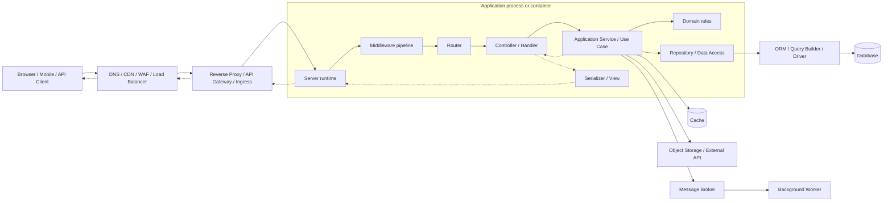
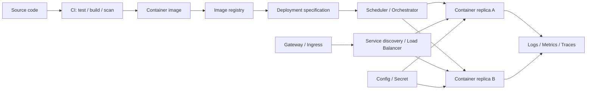

# 服务端全景图

## 学习状态

第一轮完成。这张图作为后续深度学习的导航底图，不将“能描述组件位置”视为掌握完成。

## 一句话总览

服务端的核心职责是：接收外部请求，在可信边界内执行身份校验和业务规则，协调数据库及其他系统产生状态变化，再返回可被客户端消费的结果。

一个完整服务端系统最好从三条路径理解：

1. **请求路径（request path）**：一次请求如何进入应用、执行业务并返回。
2. **数据路径（data path）**：状态如何读取、修改、提交以及异步传播。
3. **交付路径（delivery path）**：代码如何变成生产环境里可接收流量的进程。

只看其中任何一条，都会觉得网关、中间件、ORM、容器等组件彼此零散。

## 全栈的横向分区

| 区域 | 主要职责 | 常见组件 |
| --- | --- | --- |
| Client / Presentation | 交互、页面状态、渲染、客户端路由、调用服务端 | Browser、React / Vue、SSR / BFF |
| Edge / Traffic | 域名、TLS、缓存、防护、流量入口与实例选择 | DNS、CDN、WAF、Gateway、Load Balancer |
| Application | 协议适配、业务用例、领域规则与外部系统协调 | Runtime、Middleware、Router、Controller、Service、Domain |
| Data / Integration | 持久状态、缓存、异步消息、文件和第三方能力 | ORM、Database、Redis、Message Broker、Object Storage |
| Platform / Operations | 构建、配置、运行、扩缩容、发布与诊断 | CI/CD、Container、Orchestrator、Logs、Metrics、Traces |

Security 和 observability 不是某个单独方框，而是横跨所有区域的系统属性。服务端是中间三层的核心连接点：它既接住前端请求，也控制数据变化，还必须能够被平台可靠运行。

## 请求与数据全景



这张图展示的是职责关系，不代表每个方框都必须是一个独立进程，也不代表所有项目都需要每一层。小服务可以把 controller 和 service 写在一起，但仍然要知道当前代码承担了哪些职责。

## 关键组件的边界

| 组件 | 主要回答的问题 | 通常位于哪里 | 不应该把它理解成什么 |
| --- | --- | --- | --- |
| DNS / CDN / WAF | 请求去哪里、静态内容能否就近返回、恶意流量是否拦截 | 应用之外的边缘层 | 业务逻辑层 |
| Load Balancer | 这一条请求交给哪个健康实例 | 应用实例之前 | 路由到业务 handler 的 router |
| Reverse Proxy / Gateway | 哪个域名或路径去哪个服务；是否统一限流、鉴权、TLS 终止 | 服务集群入口 | 应用内部 middleware 的简单别名 |
| Server Runtime | 谁监听端口、接收连接、调度 I/O 并构造 request / response | 应用进程入口 | 业务框架本身 |
| Middleware | 这次请求进入 handler 前后要统一执行什么 | 应用请求管线 | 一个必然独立部署的服务 |
| Router | 当前 method + path 应该选择哪个 handler | middleware 之后或其中 | 业务规则的执行者 |
| Controller / Handler | 如何把 HTTP 输入转换成 use case 输入，并把结果转换成 HTTP 输出 | transport 层 | 承载复杂业务规则的地方 |
| Application Service / Use Case | 为完成一个业务动作，需要按什么顺序协调规则、存储和外部系统 | 应用层 | HTTP、SQL 等基础设施细节 |
| Domain | 哪些业务状态与变化是合法的 | 业务核心 | ORM model 的同义词 |
| Repository / Data Access | 应用用什么接口读写持久化状态 | 应用层与数据层边界 | 数据库本身 |
| ORM / Query Builder / Driver | 程序对象或查询表达式如何变成 SQL 和数据库协议调用 | 数据访问实现内部 | 数据库、schema 设计或事务的替代品 |
| Database | 如何持久化数据、执行查询、索引、约束和事务 | 独立的有状态系统 | 一个普通容器内文件或 ORM 的附属品 |
| View / Serializer | 结果最终以 HTML、JSON 或其他 representation 如何呈现 | 输出边界 | 一定存在的服务端模板目录 |

## 你提到的几个概念如何连接

### 网关、Middleware、Router

三者都可能“处理请求”，但作用域不同：

```text
Gateway：在进入某个应用之前决定去哪个服务
Middleware：进入应用后，对一类请求统一执行横切逻辑
Router：根据 method + path 选择具体 handler
```

例如 `POST /orders`：

1. Gateway 根据域名和 `/api` 前缀把请求转给 order service。
2. Middleware 生成 request id、记录日志、校验 token、设置超时。
3. Router 把 `POST /orders` 匹配到 `createOrder` handler。

边界并非绝对。Gateway 也可以通过 plugin 执行鉴权和限流，有些框架也把 router 前后的函数统称 middleware。判断一个组件时，优先问它**运行在哪里、作用于哪些请求、失败由谁负责**，不要只看名字。

### View 在现代全栈中的位置

`View` 有两种常见语境：

- 传统服务端 MVC：View 是模板，把数据渲染为 HTML。
- Django / DRF 等框架：View 往往承担接收请求、调用业务逻辑和返回响应的 handler / controller 职责。
- SPA / API 架构：页面 View 主要在前端；服务端通常通过 serializer、DTO 或 presenter 生成 JSON representation。

所以不要跨框架仅凭 `View` 这个名字判断分层。应该看它实际负责的是请求适配、业务编排还是输出渲染。服务端项目里没有 `views/` 目录也不代表缺少输出层；真正要检查的是数据库模型是否被直接暴露给客户端，还是经过了明确的输出转换。

### ORM 与数据库

ORM 处于应用与数据库之间，但它没有取代数据库知识：

```text
Application object / method
-> ORM or query builder
-> SQL
-> database parser / planner / executor
-> index and storage
-> rows / transaction result
```

ORM 擅长减少重复映射、管理关系和迁移；数据库仍然负责 schema、constraint、index、transaction、lock、query plan 与持久化。只会 ORM API 而不会检查生成的 SQL，通常是“demo 能跑、生产不透”的主要来源之一。

### 容器化与服务部署

容器化解决的是“如何把应用及其运行依赖封装成一致的可运行单元”；部署解决的是“如何把这个单元安全地放到目标环境，维持副本并接入流量”。



一个 container 本质上仍是宿主机上的隔离进程。Image 是静态制品，container 是运行实例，Deployment 是期望状态，Service / Load Balancer 负责找到健康实例，Gateway / Ingress 负责从集群外接入流量。

## 一次请求的完整生命周期

以 `POST /orders` 为例：

1. 客户端解析域名，建立 TCP / TLS 连接并发送 HTTP request。
2. Edge / Gateway 执行 TLS 终止、WAF、限流或服务转发。
3. Load Balancer 选择一个健康的应用实例。
4. Server runtime 接收字节并构造框架 request object。
5. Middleware 建立 request context，处理日志、超时、认证和 body parsing。
6. Router 根据 method + path 选择 controller。
7. Controller 校验 transport-level 输入并调用 `CreateOrder` use case。
8. Application service 执行业务流程；domain 检查订单规则。
9. Repository 通过 ORM / SQL 在 transaction 中读写数据库。
10. 必要时写 outbox 或发送 message，交由 worker 异步处理库存、通知等副作用。
11. Controller / serializer 将结果转换为 status、headers 和 JSON。
12. 响应原路返回；log、metric 和 trace 记录这条链路的结果与耗时。

“透彻”不是能背出这 12 步，而是能在任何一步失败时回答：错误在哪里被发现、由谁重试、状态是否已提交、客户端看到了什么、日志如何关联。

## 两个平面不要混在一起

### Data Plane

真实用户请求正在经过的路径：Gateway、Load Balancer、应用实例、Cache、Database、Message Broker。

### Control Plane

让系统达到并维持期望状态的路径：CI/CD、image registry、scheduler、deployment controller、configuration、secret、autoscaling。

容器启动成功属于 control plane 的结果；某次请求经 gateway 到应用再访问数据库属于 data plane。服务部署学习经常混乱，就是因为两条路径被画在了同一条线上。

## 常见误区

- 把框架目录结构当成系统架构；目录名相同不代表职责边界清晰。
- 把 middleware 当成业务层，导致鉴权、日志和业务规则相互缠绕。
- controller 直接调用 ORM 并堆积全部逻辑，使 HTTP、业务和数据访问无法独立测试。
- 认为用了 ORM 就不需要理解 SQL、索引与事务。
- 认为写了 Dockerfile 就完成了部署，忽略配置、secret、健康检查、发布、回滚和观测。
- 认为用了 Gateway 就天然具备安全和高可用；策略、健康检查、超时和失败模式仍需明确配置。
- 为了“分层”创建大量空壳类；层的价值来自职责与变化原因，而不是文件数量。

## 针对当前基础的学习策略

你已经对各组件略有了解，也做过 demo，下一阶段不适合继续横向看更多框架教程。更有效的方法是选择一个小服务，纵向追踪一条真实请求，要求每一层都能观测、替换和制造失败。

推荐最小纵切项目：

```text
Nginx or Caddy gateway
-> TypeScript / Node.js service
-> request-id and logging middleware
-> router / controller / service / repository
-> ORM or query builder + PostgreSQL
-> Docker Compose
-> health check + graceful shutdown
```

第一轮只实现一个写接口和一个读接口。第二轮再加入 transaction、重复请求、超时、数据库断开、容器重启与滚动发布，不急着引入微服务或 Kubernetes。

## 下一步

按 [全栈学习路线](./roadmap.md) 进入 [后端运行时与 HTTP 基础](./02-backend-http-foundations.md)，先把进程、socket、event loop 与 HTTP 请求的关系学到可诊断深度，再沿全景图逐层扩展。
