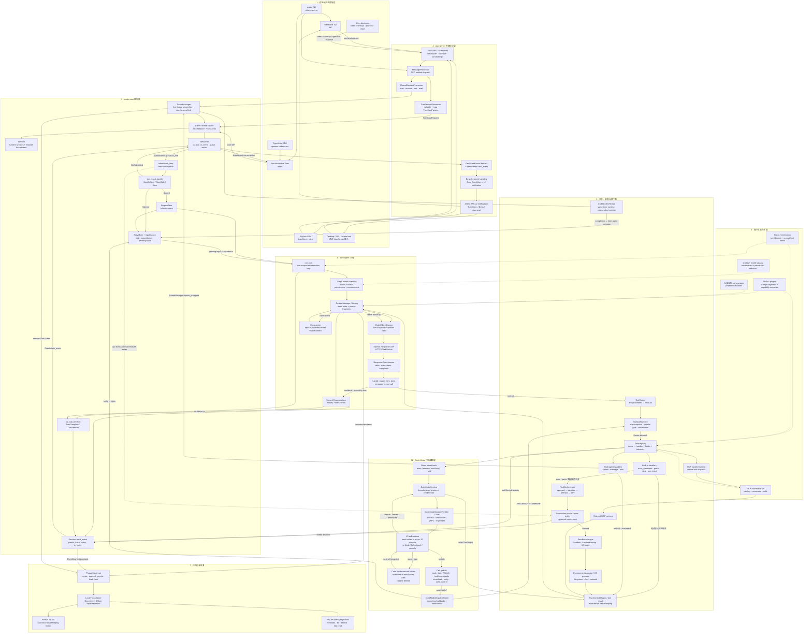

# openai/codex · 真实架构全景图

返回：[openai/codex 源码学习路线](../openai-codex.md) / [主题 1：系统边界与协议骨架](./01-system-boundary-and-protocol.md) / [Progress](../../../progress.md)

## 图的范围

- 本地源码 revision：`2df67054232090af8d2fa197c46b994bc2b0dda1`
- 覆盖：CLI、TUI、Exec、App Server、Core、模型循环、工具、Code Mode、安全、扩展、多 Agent、持久化和事件回传。
- 外部系统：OpenAI Responses API、MCP servers、OS executor 只画到 Codex 的真实边界，不猜测服务内部实现。
- 不包含：未开源的 IDE extension UI 和 Codex cloud 调度实现。

## 完整架构图



## 读图方法

主路径按编号从上到下：

1. 宿主把用户动作转换成 App Server request 或 Core API 调用。
2. App Server 负责稳定的 Thread / Turn / Item 外部协议，不承载 Agent 核心逻辑。
3. Core 通过 `Op` command queue 串行裁决状态转换，再把长耗时 turn 放到独立 task。
4. `run_turn` 在一个 turn 内循环进行 context snapshot、模型 sampling、输出处理和 follow-up。
5. 工具调用经过 ToolCallRuntime 和 registry；有进程副作用的工具继续经过 policy、approval 和 sandbox。Code Mode 则让模型先提交 JavaScript，再由 V8 cell 通过 delegate 递归调用同一批 registry tools。
6. AGENTS、Skills、Plugins、MCP、Hooks 从不同阶段注入指令或能力，不取代 Agent loop。
7. history 和 event 进入 `ThreadStore`；本地实现以 JSONL 为 canonical replay、SQLite 为可查询投影。

实线表示运行期主数据/控制路径，虚线表示配置、指令或能力注入。

## Code Mode 在架构中的位置

Code Mode 不是 Built-in、MCP、Subagent 之外的第四类底层能力，而是覆盖在原工具系统之上的 **代码编排层**：

```text
LLM → outer `exec` custom tool → JavaScript source
→ CodeModeService → CodeModeSession / host → V8 cell
→ await tools.exec_command(...) / tools.mcp__...(...)
→ CodeModeDispatchBroker
→ ToolCallRuntime → ToolRouter → ToolRegistry → 原 handler
→ nested result 回到 JavaScript
→ JavaScript 聚合输出 → outer ToolOutput → ContextManager
```

这里有两个不同的 `exec` 概念：

- Code Mode 的外层 [`exec`](/Users/bytedance/mind/codex/codex-rs/code-mode-protocol/src/lib.rs:50) 是一个接收 raw JavaScript 的 freeform model tool。
- JavaScript 内的 `tools.exec_command(...)` 才是调用 shell built-in；它仍会经过原有 Registry、policy、approval 和 sandbox。

因此 V8 cell 本身不直接获得 filesystem、shell 或 network 权限。它没有 Node、文件系统、网络和 console API；需要副作用时只能调用暴露在 `tools` global 上的 nested tools。Code Mode 改变的是“模型如何组合工具”，不绕过工具的权限边界。

同一个 Code Mode session 归属于一个 Codex thread。每次 `exec` 创建新的 cell/V8 isolate，但 `store/load` 值可在该 runtime session 的多个 cells 之间共享；长时间运行的 cell 可以先返回 `Yielded + cell_id`，随后由外层 `wait` 继续观察或终止。

## 从宏观到微观的心智模型

可以把 Codex 开源 Agent harness 压缩成三层：

```text
Host / Integration
  → Macro control loop：ThreadManager · CodexThread · Session
    → Turn agent loop：context → model → tool → context
      → Micro execution：built-in · MCP · subagent/collaboration
```

这个分层适合建立整体认识，但它是**概念分层**，不是三个彼此独立的 crate。`Session` 控制面和 `run_turn` 都实现在 `codex-core` 内。

### 1. 入口不是两个同构通道

- TypeScript SDK 是集成入口，但当前实现通过 [`CodexExec::run`](/Users/bytedance/mind/codex/sdk/typescript/src/exec.ts:91) 启动 `codex exec --experimental-json` 子进程；它不是把 `codex-core` 当作 TS 进程内 library 调用。
- App Server 是长期运行、双向异步的 JSON-RPC 协议边界，适合 TUI、桌面端、IDE 或自定义 host 管理 Thread / Turn / Item 和 approval。
- CLI 是宿主选择器：它可以启动 TUI、Exec 或 App Server。因而更精确的说法是“多种 adapter 经不同传输路径收口到 Core”，不是“SDK 与 App Server 两个完全对称的入口”。

### 2. Macro control loop 管理活跃 Thread 和 Session

[`ThreadManagerState`](/Users/bytedance/mind/codex/codex-rs/core/src/thread_manager.rs:336) 用内存中的 `HashMap<ThreadId, Arc<CodexThread>>` 持有 live threads；[`CodexThread`](/Users/bytedance/mind/codex/codex-rs/core/src/codex_thread.rs:202) 是宿主面对的 façade；[`Session`](/Users/bytedance/mind/codex/codex-rs/core/src/session/session.rs:40) 则持有 session state、command/event channel、services 和 active turn。

这一层更像 Agent runtime 的 **control plane / orchestration layer**，而不完全等同于传统服务端的业务层。它负责：

- start、resume、fork 和 live thread ownership；
- 串行裁决 `Op`，决定 start、steer、interrupt、approval 或 shutdown；
- 保证一个 session 同时最多有一个 running task；
- 启动、取消和回收 turn task，并发布生命周期事件。

源码中没有一个单独命名为 `SessionStore` 的内存仓库。所谓“内存中的活跃态”实际分布在 `ThreadManagerState.threads`、`SessionState`、[`ActiveTurn`](/Users/bytedance/mind/codex/codex-rs/core/src/state/turn.rs:32)、`TurnState`、input queue 和 `ContextManager` 中。

### 3. Turn agent loop 是 Core 内的 data plane

[`run_turn`](/Users/bytedance/mind/codex/codex-rs/core/src/session/turn.rs:153) 才是一个 turn 内真正反复运行的 Agent loop：

```text
读取/组装 ContextManager
→ 建立 StepContext 快照
→ 调用 Responses API
→ 处理 assistant item 或 tool call
→ 记录 tool result / 新输入 / 子 Agent 消息
→ 判断 needs_follow_up
→ 再次 sampling 或结束 turn
```

把它称作 runtime 或 data plane 是合理的，但配置、AGENTS、Skills、Plugins 和 MCP 并不是每次循环都从磁盘重新加载。它们分别在 thread/session 初始化、turn context 构造或 tool registry 构造阶段被发现、解析和快照化，再以 prompt fragment、tool metadata、handler 或 hook 的形式参与本轮执行。

### 4. 持久化保存可恢复事实，不是内存对象快照

Core control plane 和 turn loop 都会通过 [`ThreadStore`](/Users/bytedance/mind/codex/codex-rs/thread-store/src/store.rs:68) 读写历史。当前 [`LocalThreadStore`](/Users/bytedance/mind/codex/codex-rs/thread-store/src/local/mod.rs:124) 有两个主要表面：

- Rollout JSONL：canonical durable replay history，保存可重放的 conversation / rollout items 和相关事件；
- SQLite：面向 list、read、search 的 metadata / projection，加速查询和索引。

所以“状态、事件、证据、结果都持久化”只能作为上层概括。更精确的表达是：持久化的是恢复与审计需要的 **rollout facts、conversation items、event items 和 metadata**；Tokio task、channel、lock、pending oneshot、进程句柄等瞬时运行对象不会原样持久化。

### 5. Micro execution 有三种能力形态，但回流语义不完全相同

[`ToolRouter`](/Users/bytedance/mind/codex/codex-rs/core/src/tools/router.rs:68) 把 Responses wire item 转成内部 `ToolCall`，[`ToolRegistry`](/Users/bytedance/mind/codex/codex-rs/core/src/tools/registry.rs:271) 再映射到 handler。能力可以按理解分成三类：

| 能力 | 执行方式 | 如何回到父 turn |
| --- | --- | --- |
| Built-in | Codex 内部 handler；`exec_command`、`patch` 等副作用路径进入 policy、approval、sandbox、attempt/retry | 形成 model-visible tool output，记录进 context |
| MCP | MCP handler 经 `McpConnectionSet` 调用外部 MCP server | MCP result 转成 tool output，记录进 context |
| Subagent / collaboration | handler 通过 `ThreadManager::spawn_subagent` 创建独立 child `CodexThread`，它拥有自己的 Session、context 和 turn loop | `spawn`/`wait` 调用先返回工具 ack/result；child 完成内容再通过 inter-agent message / parent mailbox 注入父 active turn |

因此 Subagent 的角色确实“像工具”，但运行语义更接近 **异步 child runtime**。它不是一个普通函数调用：父 Agent 可以先继续运行、发送消息或等待；子 Agent 的最终内容也不是简单地作为同一次 `spawn_agent` 的同步 `FunctionCallOutput` 返回。

另外，并非所有 built-in 都经过 sandbox。只有需要执行外部进程、修改文件或受权限控制的副作用路径才进入 [`ToolOrchestrator::run`](/Users/bytedance/mind/codex/codex-rs/core/src/tools/orchestrator.rs:125)；纯读取、状态查询或交互类 handler 可以直接产生结果。

### 一段更精确的复述

> Codex 通过 CLI、Exec/SDK 与 App Server 等 host adapter 接收请求，并统一进入 `codex-core`。Core 的 ThreadManager、CodexThread 与 Session 构成宏观控制面，负责 live thread ownership、command admission、active turn 与生命周期事件；`run_turn` 构成 turn 级 data plane，在 ContextManager、Responses sampling 和 tool follow-up 之间循环。工具调用经 ToolRouter 和 ToolRegistry 分派到 built-in、MCP 或 collaboration handler：副作用 built-in 还要经过 policy、approval 与 sandbox，MCP 转发给外部 server，subagent 则创建一个独立 child thread 并通过 mailbox 异步回传。模型可见的结果和新消息被记录进 context，决定继续 sampling 或完成；可恢复的 rollout facts 与 metadata 通过 ThreadStore 写入 JSONL 和 SQLite，而 live task、channel 与 pending waiter 保留在内存中。

## 两个闭环

### 模型—工具闭环

```text
history → ModelClientSession → Responses stream
→ tool call → ToolRouter → ToolRegistry → handler
→ tool result → history → 下一次 sampling
```

模型只提出 tool call；真正的执行权限由 handler 之后的 policy、approval 和 sandbox 决定。

### Command—event 闭环

```text
host request → Op → submission_loop → turn task
→ EventMsg → persistence → App Server notification → host
```

宿主的后续 approval、interrupt 或 steer 又会变成新的 command，回到同一个 session queue。

## 关键源码坐标

| 架构节点 | 本地源码 | 主要责任 |
| --- | --- | --- |
| CLI dispatch | [`main.rs`](/Users/bytedance/mind/codex/codex-rs/cli/src/main.rs:1040) | 选择 TUI、Exec、App Server 等 adapter |
| TUI request | [`AppServerSession::turn_start`](/Users/bytedance/mind/codex/codex-rs/tui/src/app_server_session.rs:1179) | 构造 `TurnStartParams` |
| App Server mapping | [`turn_start_inner`](/Users/bytedance/mind/codex/codex-rs/app-server/src/request_processors/turn_processor.rs:478) | 外部 v2 request → Core request |
| Thread ownership | [`ThreadManager`](/Users/bytedance/mind/codex/codex-rs/core/src/thread_manager.rs:218) | start、resume、fork 和 live thread 管理 |
| Core façade | [`CodexThread`](/Users/bytedance/mind/codex/codex-rs/core/src/codex_thread.rs:202) | 隔离宿主与 `Session` 内部状态 |
| Command loop | [`submission_loop`](/Users/bytedance/mind/codex/codex-rs/core/src/session/handlers.rs:514) | 串行 dispatch `Op` |
| Start / steer | [`start_or_steer`](/Users/bytedance/mind/codex/codex-rs/core/src/session/turn_input.rs:166) | 裁决新 turn、steer 或拒绝 |
| Turn task | [`RegularTask::run`](/Users/bytedance/mind/codex/codex-rs/core/src/tasks/regular.rs:39) | 发出 TurnStarted 并进入 `run_turn` |
| Agent loop | [`run_turn`](/Users/bytedance/mind/codex/codex-rs/core/src/session/turn.rs:153) | context、sampling、tool follow-up、compaction |
| Model boundary | [`ModelClientSession::stream`](/Users/bytedance/mind/codex/codex-rs/core/src/client.rs:1878) | Responses API 流式边界 |
| Output dispatch | [`handle_output_item_done`](/Users/bytedance/mind/codex/codex-rs/core/src/stream_events_utils.rs:289) | 区分普通输出与 tool call |
| Tool routing | [`ToolRouter`](/Users/bytedance/mind/codex/codex-rs/core/src/tools/router.rs:68) | wire item → internal `ToolCall` |
| Tool registry | [`ToolRegistry`](/Users/bytedance/mind/codex/codex-rs/core/src/tools/registry.rs:271) | handler、hook、telemetry 和终态 |
| Code Mode exposure | [`register_code_mode_executors`](/Users/bytedance/mind/codex/codex-rs/core/src/tools/spec_plan.rs:706) | 收集 nested tools，注册外层 `exec` / `wait` |
| Code Mode handler | [`CodeModeExecuteHandler`](/Users/bytedance/mind/codex/codex-rs/core/src/tools/code_mode/execute_handler.rs:20) | JavaScript source → CodeModeService cell execution |
| Code Mode service | [`CodeModeService`](/Users/bytedance/mind/codex/codex-rs/core/src/tools/code_mode/mod.rs:69) | thread-owned session、execute/wait/terminate 和 worker |
| Nested-tool bridge | [`call_nested_tool`](/Users/bytedance/mind/codex/codex-rs/core/src/tools/code_mode/mod.rs:327) | cell callback → `ToolCallSource::CodeMode` → 原 ToolCallRuntime |
| V8 globals | [`install_globals`](/Users/bytedance/mind/codex/codex-rs/code-mode-runtime/src/runtime/globals.rs:15) | 安装 `tools`、helpers，删除不允许的 globals |
| Security orchestration | [`ToolOrchestrator::run`](/Users/bytedance/mind/codex/codex-rs/core/src/tools/orchestrator.rs:125) | approval、sandbox、attempt、retry |
| MCP runtime | [`McpConnectionSet`](/Users/bytedance/mind/codex/codex-rs/codex-mcp/src/connection_manager.rs:181) | MCP 连接、catalog、resource 和 call |
| Subagent creation | [`spawn_subagent`](/Users/bytedance/mind/codex/codex-rs/core/src/thread_manager.rs:961) | 从父历史快照创建独立 child thread |
| Event publishing | [`Session::send_event`](/Users/bytedance/mind/codex/codex-rs/core/src/session/mod.rs:1917) | persistence、trace、status 和 event channel |
| Event translation | [`apply_bespoke_event_handling`](/Users/bytedance/mind/codex/codex-rs/app-server/src/bespoke_event_handling.rs:143) | Core `EventMsg` → App Server v2 notification |
| Storage contract | [`ThreadStore`](/Users/bytedance/mind/codex/codex-rs/thread-store/src/store.rs:68) | storage-neutral durable boundary |
| Local storage | [`LocalThreadStore`](/Users/bytedance/mind/codex/codex-rs/thread-store/src/local/mod.rs:124) | JSONL canonical history + SQLite projection |

## “完整”的边界

这张图完整覆盖本地开源 Agent harness 的主要运行路径，但有意折叠了三类细节：

- TUI 的渲染组件、键盘输入和主题系统。
- 每一种 built-in tool 与每个平台 sandbox 的内部实现。
- Responses API、MCP server、远程 environment 和未开源产品层的内部架构。

这些部分应在对应主题中展开，不应凭猜测补到 Codex runtime 图中。
